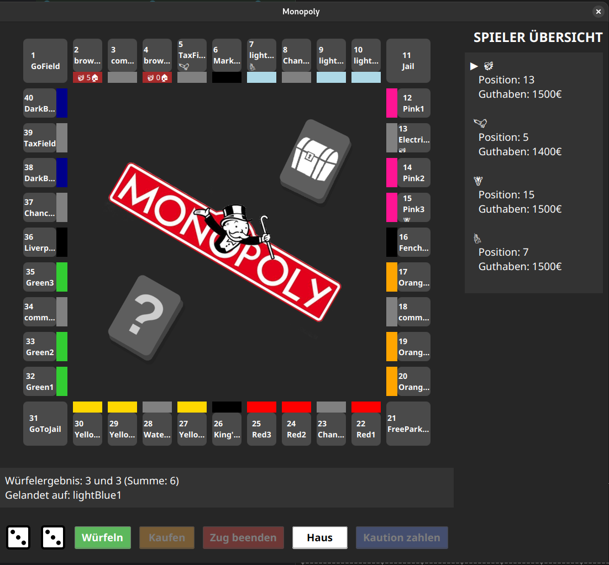
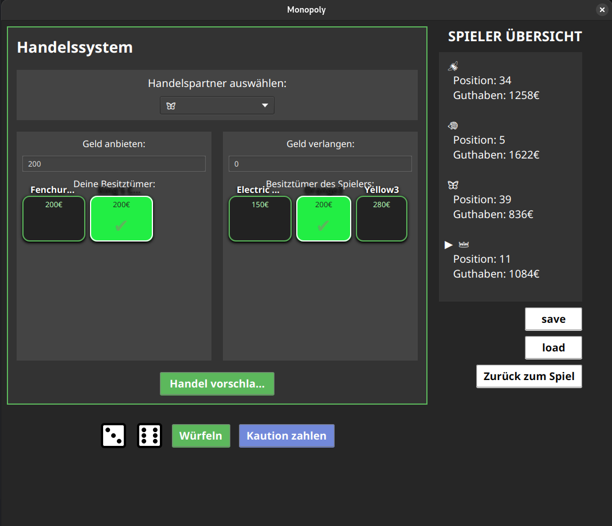

<div align="center">

# 🎲 Monopoly Game

*A modern Scala implementation of the classic board game*

[](https://coveralls.io/github/Jakoubs/Monopoly?branch=main)
[](https://github.com/Jakoubs/Monopoly/actions/workflows/scala.yml)
[](https://github.com/Jakoubs/Monopoly/commits/main)
[](https://opensource.org/licenses/MIT)
[](https://www.scala-lang.org/download/)

[Installation](#-installation) •
[Usage](#-usage) •
[Contributing](#-contributing) •
[License](#-license)

<div align="center">
    
    
</div>

</div>

- 🎮 Full implementation of classic Monopoly rules
- 👥 Multiplayer support
- 🏠 Property management system
- 💰 Trading and auction mechanics
- 🎲 Interactive dice rolling
- 🎯 State-based game progression
- 🖥️ Text-based user interface (TUI)
- 🖼️ Graphical user interface (GUI)

## 🚀 Installation

### Prerequisites

- Java SDK 23
- Scala 3.3
- sbt (Scala Build Tool)

### Quick Start

```bash
# Clone the repository
git clone https://github.com/Jakoubs/Monopoly.git

# Navigate to project directory
cd Monopoly

# Build the project
sbt compile

# Run tests
sbt clean coverage test
```

## 🎮 Usage

### Starting the Game

```bash
sbt run
```

### Game Flow

1. 🎲 Roll dice to move
2. 🏠 Land on property
3. 💰 Buy property or pay rent
4. 🔄 End turn
5. 👥 Next player's turn

## 🛠️ Project Structure

```
de.htwg/
├── 📁 controller/      # Game logic and event handling
├── 📁 model/          # Data structures and game state
├── 📁 util/          # Observer logic
└── 📁 view/           # User interface components
```

## 🤝 Contributing

We welcome contributions! Here's how you can help:

1. 🍴 Fork the repository
2. 🔧 Create your feature branch
   ```bash
   git checkout -b feature/AmazingFeature
   ```
3. 💾 Commit your changes
   ```bash
   git commit -m '✨ Add some AmazingFeature'
   ```
4. 📤 Push to the branch
   ```bash
   git push origin feature/AmazingFeature
   ```
5. 🔄 Open a Pull Request

### Commit Message Guidelines

```
✨ feat: Add new feature
🐛 fix: Fix a bug
📚 docs: Update documentation
🎨 style: Format code
♻️ refactor: Refactor code
🧪 test: Add tests
```

## 📋 Development Status

- [x] Basic game mechanics
- [x] Property management
- [x] Player turns
- [x] Dice rolling system
- [x] Code patterns
- [x] GUI implementation
- [x] Save game status
- [ ] Docker
- [ ] AI opponents

## 🧪 Testing

```bash
# Run all tests
sbt test

# Run specific test suite
sbt "testOnly de.htwg.model.PlayerTest"

# Check coverage
sbt coverage test
sbt coverageReport
```

## 📜 License

This project is licensed under the MIT License - see the [LICENSE](LICENSE) file for details.

## 🙏 Acknowledgments

- HTWG Konstanz Software Engineering Course
- The Scala community for their resources

## 👨‍💻 Contributors

<table>
  <tr>
    <td align="center">
      <a href="https://github.com/Jakoubs">
        <br />
        <sub><b>Jakob Strohmaier</b></sub>
      </a>
    </td>
    <td align="center">
      <a href="https://github.com/BrutTim">
        <br />
        <sub><b>BrutTim</b></sub>
      </a>
    </td>
  </tr>
</table>

---

<div align="center">

Made with ❤️ by [Jakoubs](https://github.com/Jakoubs) & [BrutTim](https://github.com/BrutTim)

</div>
```
